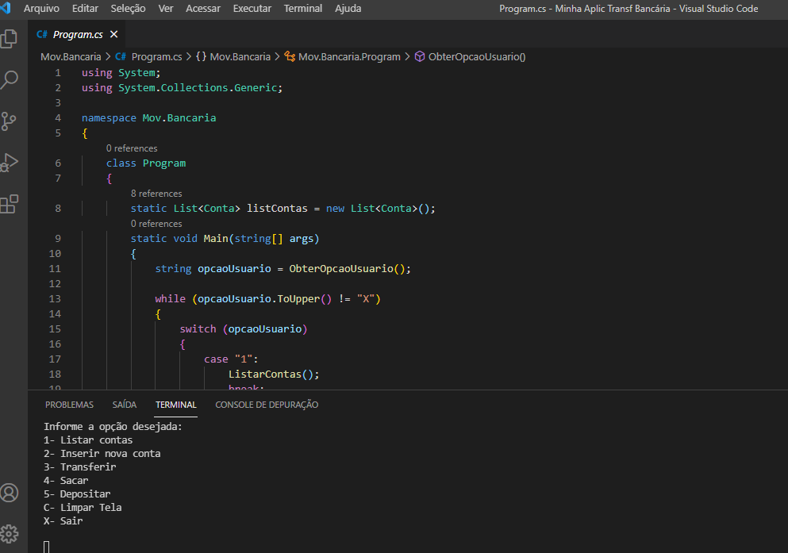

  

 

 ## 🚀 Tecnologias

- C# 
- .NET (framework)

## 💻 Projeto

Algoritimo de Movimentação Bancária , foi desenvolvido em linguagem em C# + .NET , foi apresentado e projetado pelo professor Eliézer Zarpelão na matéria "Criando Aplicação Bancária em C#" na plataforma da DIO (Digital Innovation One).

Neste projeto, o algoritimo adiciona nome da conta, verifica saldo, e faz movimentações de : Transferência, Saque e Depósito.

 
## 📝 Aprendizado - Anderson Nascimento

 Foi meu segundo contato com a linguagem C# e o framework .NET , muito boa a experiência. 😀

 
 ## 📝 Como Executar ??

 1)Baixar e instalar a biblioteca .NET SDK (caso ja possua, ignore)

 2)Acessar o diretório "MovBancaria-Csharp-.NET', utilizando o Visual Studio ou PowerShell e executar o comando:

 * dotnet run